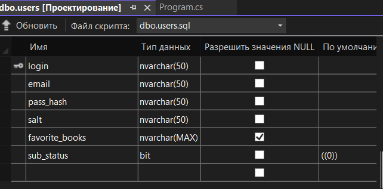
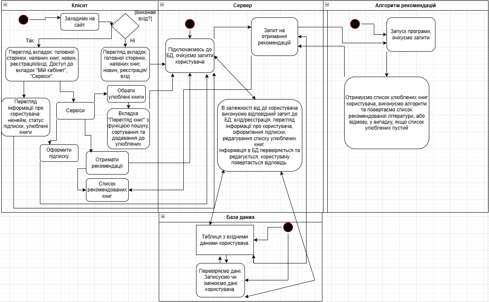
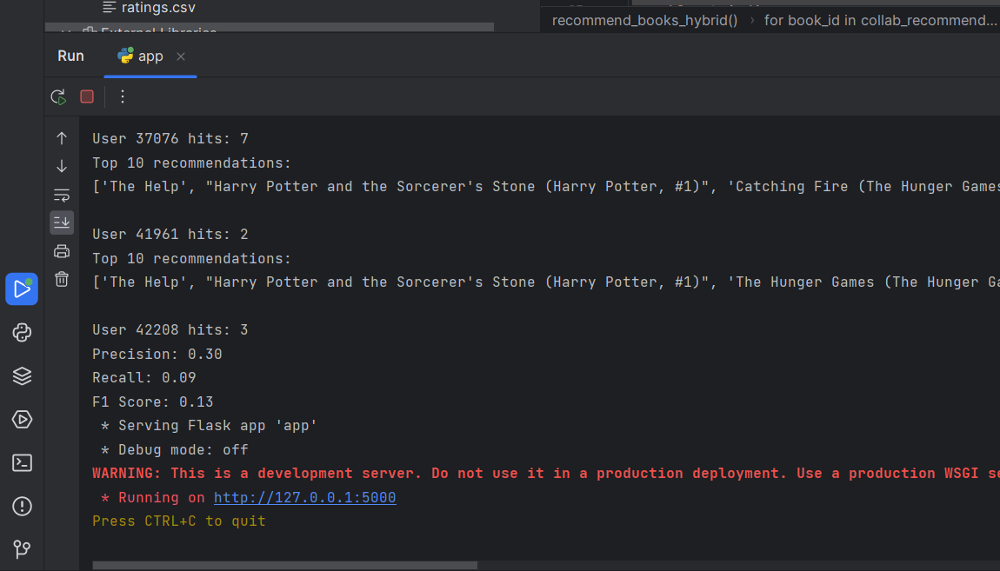

# 📚 BookRecommender

**BookRecommender** is a system for book recommendations that integrates three main components:

1. **Recommender** - A Flask application for machine learning that generates recommendations based on book metadata and collaborative filtering.  
2. **LibraryServer** - An ASP.NET Core Web API server that handles user requests and provides an API for interacting with books, users, and recommendations.
3. **Client (wwwroot)** - Located in `LibraryServer/LibraryServer/wwwroot`, this contains all the static client-side code such as HTML, JavaScript, CSV, and CSS, which interacts with the backend via API.

---

## 🚀 Features

- Book recommendation based on metadata and user ratings  
- Book data retrieval and management  
- User authentication and management  
- Integration between a machine learning-based Flask API and a Web API server  
- JSON-based communication between the server and client  
- Fully functional local (for now) website.

---

## 📦 Build Instructions

Clone the repository and build both components:

```bash
git clone https://github.com/your-username/book-recommender.git
cd book-recommender
```

### Recommender (Flask ML API)

Navigate to the `Recommender` folder.  
Create a virtual environment (it is recommended to use `venv`).  
Install the dependencies from `requirements.txt`:

```bash
pip install -r Recommender/requirements.txt
```

Run the Flask application:

```bash
python Recommender/app.py
```

### LibraryServer (ASP.NET Core Web API)

Navigate to the `LibraryServer/LibraryServer` folder.
Create a simple database with tables similar to the screenshot:


Link DB to the project through Connection string in appsettings.json.
Open the project in Visual Studio or use the command line to run the application:

```bash
dotnet run --project LibraryServer/LibraryServer/LibraryServer.csproj
```

---

## 📂 Project Structure

```
BookRecommender/
├── Recommender/           # Flask ML API
│   ├── app.py
│   ├── books.csv
│   ├── ratings.csv
│   ├── requirements.txt
├── LibraryServer/         # ASP.NET Core Web API
│   ├── LibraryServer/     # Folder with the code for LibraryServer
│   │   ├── wwwroot/       # Folder with everything needed for the client (frontend)
│   │   ├── appsettings.json
│   │   ├── appsettings.Development.json
│   │   ├── LibraryServer.csproj
│   │   ├── Program.cs
│   ├── LibraryServer.sln  # Solution file for the .NET project
├── docs/         
│   ├── screenshots        # Screenshots with examples of program sceneries, DB maket, UML diagram etc.
├── README.md              # Main README file
```

---

## 🛠️ Dependencies

**Recommender (Flask)**  
- Python 3.x  
- Flask  
- scikit-learn  
- pandas  
- numpy  

**LibraryServer (ASP.NET Core)**  
- .NET 6 or later  
- SQL Server (for database management) with structure like on screenshot.

---

## 📡 API Usage

### Book Recommendations

To get book recommendations, send a POST request to the `/recommend` route with a JSON body:

```json
{
  "favorites": [1, 2, 3]
}
```

`favorites` — A list of book IDs based on which recommendations will be generated.

The response will contain a list of recommended books in the following format:

```json
{
  "recommendations": [
    {"title": "Book 1"},
    {"title": "Book 2"},
    ...
  ]
}
```
Or you can do it through the client interface (as shown in the screenshots; database required):
Just start the server, flask-app, go to https://localhost:7080/index.html and do the things.

---

## 🔍 Screenshots

### 📊 UML Diagram


### 🗄️ Precision metric


Additional screenshots include:
- Database layout example
- Key site functionalities
- Sample: user favorites → recommendations

📁 Located in: `docs/screenshots/`

---

## 📌 Notes

This project was developed to practice building client-server applications, using asynchronous services in ASP.NET, and to gain a better understanding of recommendation algorithms in machine learning.

---

## 📝 License

This project is licensed under the **MIT License**.  
See the [LICENSE](LICENSE) file for details.

---

## 👨‍💻 Author

Developed by [denyskovalMSW](https://github.com/denyskovalMSW)